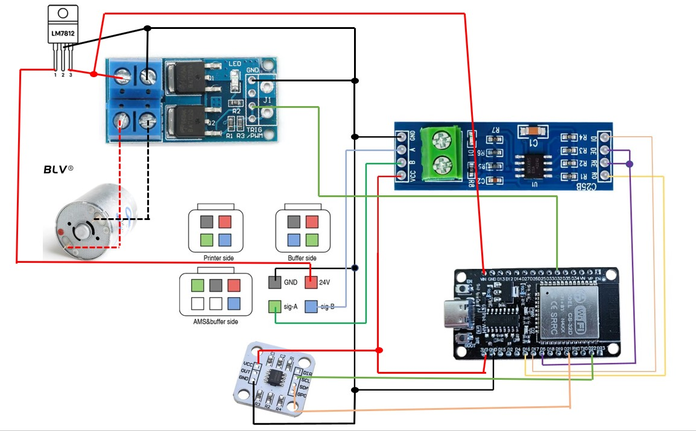
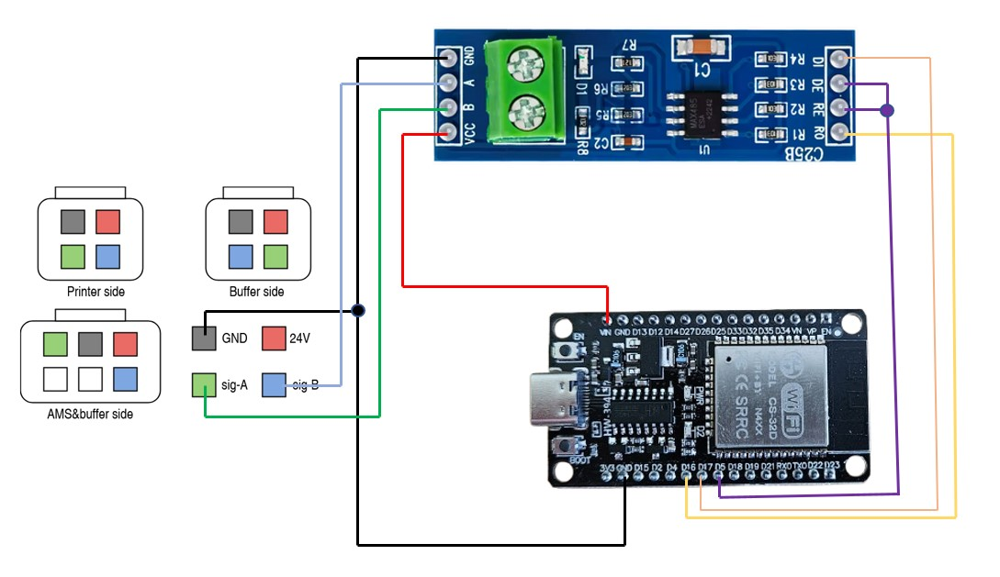
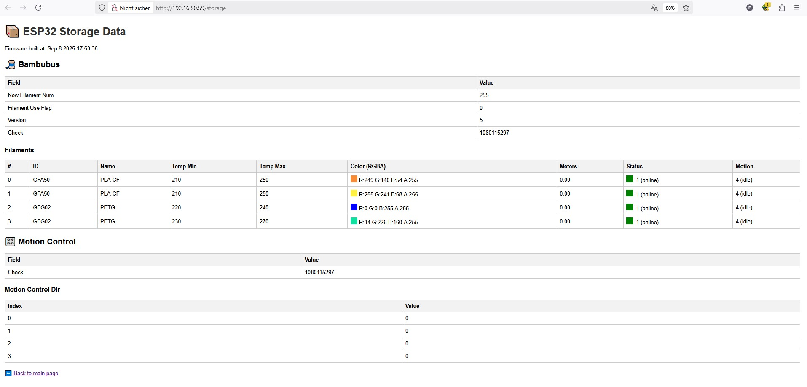

# ⚠️🔴 DISCLAIMER — USE AT YOUR OWN RISK 🔴⚠️

 **Important:** This project involves working with electronic hardware and wiring. By using, building, flashing, or following the instructions and code in this repository you accept **full responsibility** for your actions.

The author provides these files **as-is**, without any warranties — express or implied — and **does not** assume liability for any damages, including electrical damage, fire, property loss, or personal injury.

 **Always double-check wiring, voltages, and component ratings before powering anything.** If you are not experienced with electronics, consult a qualified technician. Proceed only if you understand and accept the risks.

# 📡 ESP32 ↔ MAX485 ↔ Bambulab AMS

This project demonstrates how to connect an **ESP32 DevKit (Wemos, 32 pins)** together with a **MAX485 module** to the **Bambulab AMS (Auxiliary Material System)**.  
It establishes RS485 serial communication between the AMS and the ESP32.

---

## 🖼️ Links / Sources used for ESP32 transfer

This code was used as a base and ported to the ESP32:  
https://github.com/krrr/BMCU370

There is also **OTA and WebSerial** integrated for easier analysis, but first flash you have to do by wire. 
Additional information:  

- https://wiki.bambulab.com/en/x1/troubleshooting/AMS_is_not_detected_by_the_printer  
- https://github.com/Bambu-Research-Group/Bambu-Bus  
- https://github.com/09lab/BambuBus-Sniffer  


---

## 🖼️ Version 2 (FAKE AMS with Motor and AS5600)



# Bambulab AMS DIY ESP32 - Slot 0 Wiring

This wiring diagram covers **Slot 0**: one motor and one AS5600 sensor, using ESP32, MOSFET, LM7812 voltage regulator, and MAX485 for RS485 communication.

---

## 🔌 Power Supply

| Source/Module          | Target/Module     | Voltage / Notes                   |
|------------------------|-----------------|----------------------------------|
| Bambulab AMS Pin 4      | LM7812 IN       | 24 V Input                        |
| LM7812 OUT              | MOSFET VIN      | 12 V for Motor                     |
| LM7812 GND              | ESP32 GND       | Common Ground                      |
| MOSFET GND              | ESP32 GND       | Common Ground                      |
| ESP32 3.3 V             | AS5600 VCC      | Sensor Power                        |
| ESP32 3.3 V             | MAX485 VCC      | RS485 Transceiver                   |

---

## 🖥️ ESP32 Pins

| ESP32 Pin      | Function                  | Connected to          |
|----------------|--------------------------|---------------------|
| GPIO32         | PWM_CH0                  | MOSFET PWM_IN        |
| GPIO22         | I²C SCL                  | AS5600 SCL           |
| GPIO21         | I²C SDA                  | AS5600 SDA           |
| GPIO16         | UART RX (RS485 RO)       | MAX485 RO            |
| GPIO17         | UART TX (RS485 DI)       | MAX485 DI            |
| GPIO5          | RS485 DE/RE Control      | MAX485 DE/RE         |
| GND            | Ground                   | All modules          |
| 3.3 V          | Power                    | AS5600, MAX485       |

---

## 🔧 Peripherals / Signals

| Device / Module       | Pin / Signal      | Connection / Notes                          |
|----------------------|-----------------|---------------------------------------------|
| AS5600 (Slot 0)       | SCL             | GPIO22 ESP32                                 |
| AS5600 (Slot 0)       | SDA             | GPIO21 ESP32                                 |
| AS5600 (Slot 0)       | GND             | ESP32 GND                                    |
| AS5600 (Slot 0)       | VCC             | ESP32 3.3 V                                  |
| MOSFET Module         | PWM_IN          | GPIO32 ESP32 (PWM_CH0)                       |
| MOSFET Module         | VIN             | LM7812 OUT (12 V)                            |
| MOSFET Module         | GND             | ESP32 GND                                    |
| MOSFET Module         | OUT+/OUT-       | Motor (+/-), flyback diode recommended      |
| Bambulab AMS          | Pin1 B          | MAX485 B                                     |
| Bambulab AMS          | Pin2 A          | MAX485 A                                     |
| Bambulab AMS          | Pin3 GND        | ESP32 GND                                    |
| Bambulab AMS          | Pin4 24V        | LM7812 IN                                    |
| MAX485                 | RO              | GPIO16 ESP32 (UART RX)                       |
| MAX485                 | DI              | GPIO17 ESP32 (UART TX)                       |
| MAX485                 | DE/RE           | GPIO5 ESP32                                  |
| MAX485                 | VCC             | ESP32 3.3 V                                  |
| MAX485                 | GND             | ESP32 GND                                    |

---

## 🖼️ Version 1 (minimal FAKE AMS)



---

## 🖼️ Wiring Diagram

```text
 Bambulab AMS (6-Pin)              MAX485                ESP32 (Wemos 32-Pin)
 ──────────────────────           ────────              ─────────────────────
 Pin 1 (A)  ─────────────────────► A
 Pin 2 (B)  ─────────────────────► B
 Pin 3 (GND) ────────────────────► GND ────────────────► GND
 Pin 4 (24V) ── ✗ DO NOT USE
 Pin 5 (NC)  ── ✗
 Pin 6 (NC)  ── ✗

                                   RO ────────────────► GPIO16 (RX)
                                   DI ────────────────► GPIO17 (TX)
                               DE+RE ────────────────► GPIO5
                                   VCC ───────────────► VIN (5V)

```

## 🔌 ESP32 ↔ MAX485 Pinout

| ESP32 Pin | MAX485 Pin | Description              |
|-----------|------------|--------------------------|
| GPIO 16   | RO         | RS485 → ESP32 (RX)       |
| GPIO 17   | DI         | ESP32 → RS485 (TX)       |
| GPIO 5    | DE & RE    | Direction control        |
| GND       | GND        | Ground                   |
| VIN (5 V) | VCC        | Power for MAX485 module  |

---

## 🔌 MAX485 ↔ AMS 6-Pin Cable 

According to [Bambulab Wiki – AMS Connector Pinout](https://wiki.bambulab.com/en/x1/troubleshooting/AMS_is_not_detected_by_the_printer):

| AMS Cable (6-Pin) | Signal | MAX485 Pin | Note                           |
|-------------------|--------|------------|--------------------------------|
| Pin 1             | B      | B          | RS485 differential signal      |
| Pin 2             | A      | A          | RS485 differential signal      |
| Pin 3             | GND    | GND        | Ground                         |
| Pin 4             | 24 V   | ❌ **Do not connect** |
| Pin 5             | NC     | ❌ Not used              |
| Pin 6             | NC     | ❌ Not used              |


---

## ⚠️ Notes

- **Power supply:** The MAX485 module is **not powered** from the AMS 24 V line. Instead, it is powered via the **ESP32 VIN pin (5 V)**.  
- **Direction control:** DE and RE on the MAX485 are **tied together** and connected to GPIO 5 of the ESP32.  
- **Logic levels:** The MAX485 operates at 5 V, while the ESP32 GPIOs are 3.3 V tolerant → this is compatible, as the MAX485 understands 3.3 V TTL levels.  


# 📦 Flash Storage on ESP32

This project uses a dedicated **Flash partition (`storage`)** to persist data structures.  
This ensures that settings remain available even after a restart or OTA update.

## 🖼️ Pictures





