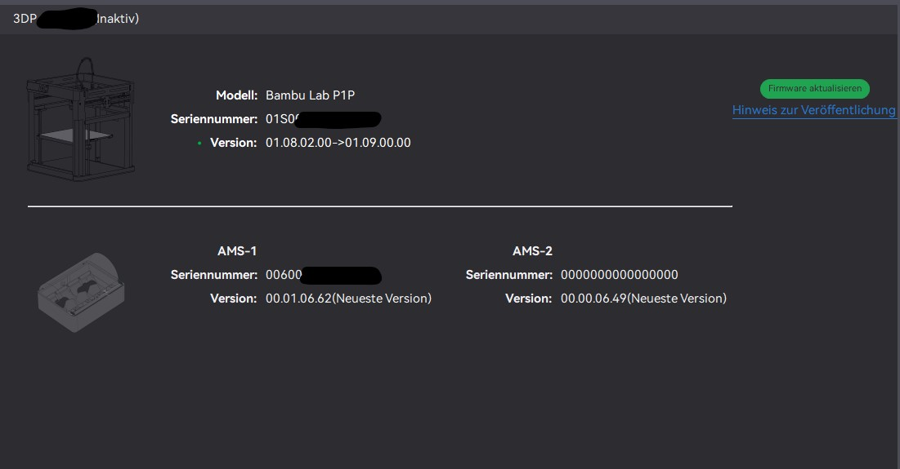
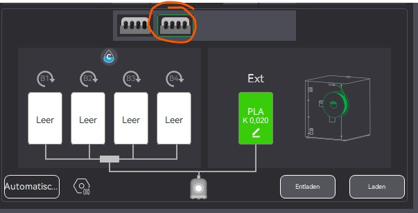
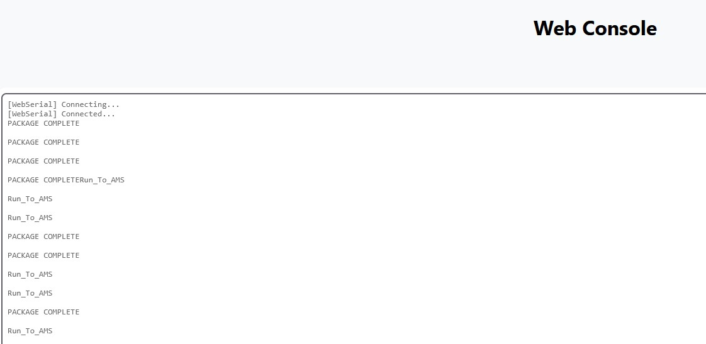

 
# 📡 ESP32 ↔ MAX485 ↔ Bambulab AMS

This project demonstrates how to connect an **ESP32 DevKit (Wemos, 32 pins)** together with a **MAX485 module** to the **Bambulab AMS (Auxiliary Material System)**.  
It establishes RS485 serial communication between the AMS and the ESP32.

---

## 🖼️ Links / Sources used for ESP32 transfer

This code was used as a base and ported to the ESP32:  
https://github.com/krrr/BMCU370

There is also a branch with **OTA and WebSerial** for easier analysis:  
https://github.com/druckgott/bambulab_ams_diy_esp32_test/tree/ota_webserial

Additional information:  

- https://wiki.bambulab.com/en/x1/troubleshooting/AMS_is_not_detected_by_the_printer  
- https://github.com/Bambu-Research-Group/Bambu-Bus  
- https://github.com/09lab/BambuBus-Sniffer  

---

## 🔌 ESP32 ↔ MAX485 Pinout

| ESP32 Pin | MAX485 Pin | Description              |
|-----------|------------|--------------------------|
| GPIO 16   | RO         | RS485 → ESP32 (RX)       |
| GPIO 17   | DI         | ESP32 → RS485 (TX)       |
| GPIO 5    | DE & RE    | Direction control        |
| GND       | GND        | Ground                   |
| VIN (5 V) | VCC        | Power for MAX485 module  |

---

## 🔌 MAX485 ↔ AMS 6-Pin Cable

According to [Bambulab Wiki – AMS Connector Pinout](https://wiki.bambulab.com/en/x1/troubleshooting/AMS_is_not_detected_by_the_printer):

| AMS Cable (6-Pin) | Signal | MAX485 Pin | Note                           |
|-------------------|--------|------------|--------------------------------|
| Pin 1             | B      | B          | RS485 differential signal      |
| Pin 2             | A      | A          | RS485 differential signal      |
| Pin 3             | GND    | GND        | Ground                         |
| Pin 4             | 24 V   | ❌ **Do not connect** |
| Pin 5             | NC     | ❌ Not used              |
| Pin 6             | NC     | ❌ Not used              |

---

## ⚠️ Notes

- **Power supply:** The MAX485 module is **not powered** from the AMS 24 V line. Instead, it is powered via the **ESP32 VIN pin (5 V)**.  
- **Direction control:** DE and RE on the MAX485 are **tied together** and connected to GPIO 5 of the ESP32.  
- **Logic levels:** The MAX485 operates at 5 V, while the ESP32 GPIOs are 3.3 V tolerant → this is compatible, as the MAX485 understands 3.3 V TTL levels.  

---

## 🖼️ Wiring Diagram

```text
 Bambulab AMS (6-Pin)              MAX485                ESP32 (Wemos 32-Pin)
 ──────────────────────           ────────              ─────────────────────
 Pin 1 (A)  ─────────────────────► A
 Pin 2 (B)  ─────────────────────► B
 Pin 3 (GND) ────────────────────► GND ────────────────► GND
 Pin 4 (24V) ── ✗ DO NOT USE
 Pin 5 (NC)  ── ✗
 Pin 6 (NC)  ── ✗

                                   RO ────────────────► GPIO16 (RX)
                                   DI ────────────────► GPIO17 (TX)
                               DE+RE ────────────────► GPIO5
                                   VCC ───────────────► VIN (5V)

```

## 🖼️ Pictures








